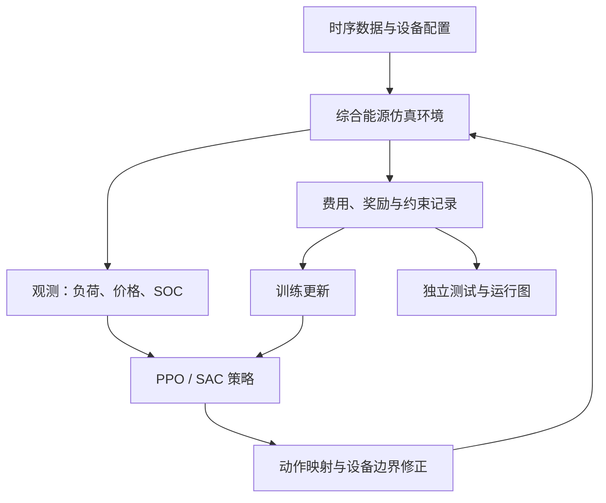
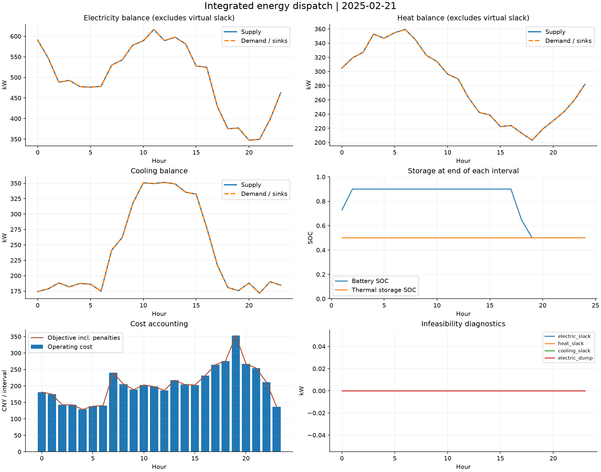

<p align="center">
  
</p>

# 基于深度强化学习的综合能源运行仿真系统

**IES-DRL Simulator · Integrated Energy System Dispatch with Deep Reinforcement Learning**

面向能源系统工程师和算法工程师的 Python 项目，用于学习如何把综合能源运行优化问题转换为强化学习环境，并完成策略训练、运行仿真与效果评估。

项目以园区“电—热—冷—气”综合能源系统为对象，协调新能源、热电联产、热泵、制冷设备、电储能和蓄热设备。工程师可以先运行示例，再逐步替换设备参数、负荷数据和控制策略。

> 当前版本：**v0.1 工程入门原型**。包含可运行仿真、PPO/SAC 训练入口、规则基准和评估工具。示例数据为合成数据；短训练用于验证程序链路，不代表算法已经收敛或优于传统优化。实际验证记录见 [VALIDATION.md](docs/VALIDATION.md)。

## 1. 项目要解决什么问题

每小时根据负荷、新能源出力、电价和储能状态，决定热电联产、热泵、储能和吸收式制冷机的运行功率，使整个运行周期的费用较低，并减少供能不足、弃能和储能期末偏差。

深度强化学习在本项目中的具体作用是：通过与仿真环境反复交互，学习“运行状态 → 设备调度动作”的策略。策略输出后，环境执行设备边界修正、辅助设备补足和能量结算，再返回奖励及下一时刻观测。

这条路线适合探索需要反复做运行决策的场景。是否比已有优化方法更好，需要同时比较运行费用、可行性、训练代价和在线决策时间，不能只比较推理速度。

## 2. 系统配置与调度分工

| 模块 | 设备或资源 | 本版本处理方式 |
|---|---|---|
| 电源 | 光伏、风电、外部电网 | 新能源为可用出力；电网按剩余电力需求购售电 |
| 多能转换 | 热电联产 CHP | 智能体决定燃气输入，按固定效率联产电和热 |
| 供热 | 热泵 HP、燃气锅炉 GB | 热泵受控；锅炉在容量范围内补足热缺口 |
| 供冷 | 吸收式制冷机 AC、电制冷机 EC | AC 受控；EC 在容量范围内补足冷缺口 |
| 储能 | 电池 BESS、蓄热 TES | 智能体决定充放功率；环境根据能量边界修正 |
| 用能 | 电负荷、热负荷、冷负荷 | 外生输入，不参与需求响应 |

英文全称和模型公式见 [数学模型](docs/MODEL.md)。初始版本采用单园区集中调度，因此使用**一个智能体控制多台设备**。

## 3. 已实现与待扩展

| 功能 | 状态 |
|---|---|
| 小时级电热冷能量平衡、燃气消耗计算 | 已实现 |
| 设备功率限制、CHP 爬坡限制、储能 SOC 限制 | 已实现 |
| 运行费用、碳成本、弃能与不可行惩罚、期末储能软目标 | 已实现 |
| Gymnasium 环境与 13 维观测、5 维连续动作 | 已实现 |
| 近端策略优化 PPO、软演员—评论家 SAC | 已实现训练和加载入口 |
| 规则控制、随机控制、逐日评估、训练曲线与运行图 | 已实现 |
| 数据检查、时间划分、验证集选模、数据和配置摘要 | 已实现 |
| GitHub Actions 检查配置、工程任务模板 | 已提供；远端执行状态以 GitHub 为准 |
| MILP / MPC 优化基准、多随机种子正式结果 | 待开发 / 待实验 |
| 电网潮流、热网水力、气网压力、设备启停 | 待扩展 |
| 可行域优化投影、约束强化学习、多智能体 | 待扩展 |
| Web 界面、现场接口、硬件在环测试 | 待扩展 |

本版本中的动作限幅只覆盖已建模的局部边界，不构成整个多能系统的安全保证。供能缺口和无法处置的电力过剩会显式记录为不可行状态。

## 4. 快速运行

建议使用 Python 3.10–3.12。以下命令在解压后的项目根目录执行。

### 4.1 先跑物理仿真和规则控制

```bash
python -m venv .venv
```

Linux/macOS 激活：`source .venv/bin/activate`。Windows PowerShell 激活：`.venv\Scripts\Activate.ps1`。

```bash
python -m pip install -e .
python -m unittest discover -s tests -v
python -m ies_drl.evaluate --policy rule --out runs/rule
python -m ies_drl.plot --evaluation runs/rule
```

已附带 60 天合成示例数据，按时间划分为 42 天训练、9 天验证、9 天测试。需要重建时执行：

```bash
python -m ies_drl.generate_data --days 60 --seed 42 --out data/demo
```

生成命令会覆盖指定目录下的同名示例数据文件。训练与评估输出目录必须为空，以保留每次实验记录。

### 4.2 安装强化学习依赖并训练

```bash
python -m pip install -e ".[rl]"
python -m unittest discover -s tests -v
python -m ies_drl.train --algo ppo --steps 100000 --seed 42 --out runs/ppo_seed42
python -m ies_drl.train --algo sac --steps 100000 --seed 42 --out runs/sac_seed42
```

只验证接口时，可先使用 `--steps 2048`。该步数不能作为效果验收依据。PPO 按完整 rollout 收集样本，实际训练步数可能向上取整，最终值保存在 `metadata.json`。

### 4.3 在独立测试集上评估

```bash
python -m ies_drl.evaluate --policy ppo --run runs/ppo_seed42 --out runs/ppo_test
python -m ies_drl.evaluate --policy sac --run runs/sac_seed42 --out runs/sac_test
python -m ies_drl.plot --evaluation runs/ppo_test --training runs/ppo_seed42
```

评估自动读取训练时保存的设备配置和验证集选出的模型；禁止把训练或验证时段当作独立测试集。默认采用 CPU，便于先验证整个流程。

## 5. 强化学习具体怎么接入

| 要素 | 项目定义 |
|---|---|
| 环境 | 综合能源设备、储能状态、能量结算和时序数据 |
| 智能体 | 使用 PPO 或 SAC 训练的策略网络 |
| 观测 | 时间编码、剩余时段、电热冷负荷、风光可用出力、电价、两类 SOC、上一时刻 CHP 输入 |
| 动作 | CHP 燃气输入、热泵电功率、电池功率、蓄热功率、AC 耗热功率 |
| 奖励 | 当期运行费用与惩罚的负值，经固定尺度缩放 |
| 一个回合 | 连续 24 个小时，从指定初始储能状态开始 |
| 状态更新 | 执行动作修正与能量结算，更新储能和 CHP 历史状态，读取下一时刻输入 |



环境遵循 Gymnasium 接口，使用 SB3 的 `check_env` 检查兼容性；实现依据见 [SB3 自定义环境文档](https://stable-baselines3.readthedocs.io/en/master/guide/custom_env.html)。

```python
from ies_drl.data import load_days
from ies_drl.env import IESEnv

env = IESEnv(load_days("data/demo/train.csv"))
obs, info = env.reset(seed=42)
action = env.action_space.sample()
next_obs, reward, terminated, truncated, info = env.step(action)
print(info["operating_cost_cny"], info["infeasible"])
```

## 6. 输出文件如何使用

| 文件 | 用途 |
|---|---|
| `dispatch.csv` | 逐时设备功率、SOC、原始 / 执行动作、供能缺口、分项费用 |
| `daily_metrics.csv` | 每日费用、排放、弃能、不可行小时数、期末偏差、决策耗时 |
| `summary.json` | 全部测试日的汇总指标与数据摘要 |
| `train.monitor.csv` | 每回合奖励和回合长度，用于真实训练曲线 |
| `validation.csv` | 每次验证的可行性、费用和期末偏差 |
| `best_model.zip` | 按验证集结果选择的模型 |
| `last_model.zip` | 最后一次训练状态的策略模型 |
| `metadata.json`、`config.json` | 算法、种子、数据摘要、依赖版本及设备配置 |
| `dispatch.png`、`learning_curve.png` | 运行图与可选训练曲线 |

`last_model.zip` 未包含 SAC 回放池、完整随机数状态及续训过程管理，不应视为精确恢复训练的检查点。

下面是规则策略在合成数据上的实际输出，用于说明运行图内容：



## 7. 工程师推荐阅读顺序

1. [工程开发指南](docs/ENGINEERING_GUIDE.md)：按照任务步骤完成本地复现和业务适配。
2. [数学模型](docs/MODEL.md)：统一设备参数、能量平衡、成本和约束。
3. [强化学习设计](docs/RL_DESIGN.md)：理解观测、动作、奖励、回合和算法选择。
4. [数据接口](docs/DATA_SPEC.md)：替换真实数据，避免单位错误和未来信息泄漏。
5. [实验验收方案](docs/EXPERIMENTS.md)：确定对照算法、场景、指标和验收条件。
6. [项目任务看板](docs/PROJECT_BOARD.md)：转成 GitHub Issues / Projects 的任务清单。
7. [发布说明](docs/GITHUB_SETUP.md)：上传仓库、设置描述和组织开发任务。

## 8. 主要代码入口

| 路径 | 内容 |
|---|---|
| `src/ies_drl/config.py` | 设备和奖励参数及合法性检查 |
| `src/ies_drl/core.py` | 与 RL 库独立的单步物理仿真 |
| `src/ies_drl/env.py` | Gymnasium 环境适配 |
| `src/ies_drl/train.py` | PPO / SAC 训练与验证集选模 |
| `src/ies_drl/evaluate.py` | 规则 / 随机 / RL 统一评估 |
| `src/ies_drl/policies.py` | 当前信息驱动的规则控制 |
| `src/ies_drl/data.py`、`generate_data.py` | 数据验证和合成场景生成 |
| `src/ies_drl/plot.py` | 运行图和训练曲线 |
| `configs/default.json` | 可直接修改的默认配置 |
| `tests/` | 物理约束、手算账目、输入异常与环境接口验证 |

项目首先把“模型—环境—训练—评估”这条工程链路做清楚。后续研究创新应围绕明确的问题展开，例如预测误差下的可行性、设备状态约束或跨园区协调，并通过公平对照验证。
